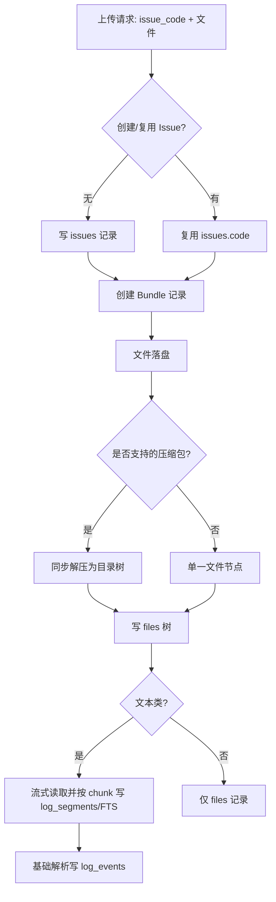

# 数据库设计概览

当前默认使用 SQLite，数据库文件由 `DATABASE_URL` 控制，默认示例为 `sqlite://../data/rain.db`。后端启动时会自动创建数据库文件的父目录，并执行 `CREATE TABLE IF NOT EXISTS` 初始化表结构。

## 设计取舍

- SQLite 适合当前本地 MVP：部署简单、无需单独数据库服务、方便重新启动项目。
- 当前搜索使用 SQLite FTS5，文本日志按 chunk 建索引，启动时会回填尚未进入 FTS 索引的历史 `log_segments`。
- 上传解析使用流式读取和事务批量写入，避免大文件一次性读入内存和逐行零散提交。
- 当前 `meta` 以 JSON 字符串存储在 TEXT 列中；后续如要对象存储或多节点部署，关键存储路径应提升为明确列。
- 生产化前建议引入迁移工具，不要长期依赖启动时建表。

## 表：issues

- `code` TEXT PK：Issue 编号（上传归属键）。
- `name` TEXT：显示名称（默认与 `code` 相同）。
- `description` TEXT：描述。
- `created_at` TEXT：创建时间，默认 `CURRENT_TIMESTAMP`。

## 表：bundles

- `id` TEXT PK：内部 bundle ID，由后端生成 UUID 字符串。
- `issue_code` TEXT：关联 `issues.code`，级联删除。
- `hash` TEXT UNIQUE：bundle 的公开 ID，前端和 API 使用它定位 bundle。
- `name` TEXT：bundle 显示名（当前为 `bundle-{hash}`）。
- `status` TEXT：上传/解析状态，当前主要写入 `READY`。
- `size_bytes` INTEGER：本次上传总字节数。
- `created_at` TEXT：创建时间，默认 `CURRENT_TIMESTAMP`。
- 索引：`idx_bundles_issue (issue_code, created_at DESC)`。

## 表：files

- `id` INTEGER PK AUTOINCREMENT。
- `bundle_id` TEXT：关联 `bundles.id`，级联删除。
- `parent_id` INTEGER：自关联父节点，级联删除。
- `name` TEXT：文件/目录名。
- `path` TEXT：bundle 内路径，如 `/{bundle_hash}/{file_name}`。
- `is_dir` INTEGER：是否目录，按 bool 读写。
- `size_bytes` INTEGER：文件大小，目录为 NULL。
- `mime_type` TEXT：MIME。
- `status` TEXT：状态标签（预留）。
- `meta` TEXT：JSON 字符串，存储 `storage_path`、原始文件名等元数据。
- `created_at` TEXT：创建时间，默认 `CURRENT_TIMESTAMP`。
- 约束：`UNIQUE (bundle_id, path)`。
- 索引：`idx_files_parent`、`idx_files_bundle`、`idx_files_path`。

## 表：log_segments

- `id` INTEGER PK AUTOINCREMENT。
- `bundle_id` TEXT：关联 `bundles.id`，级联删除。
- `file_id` INTEGER：关联 `files.id`，级联删除。
- `timeline` TEXT：时间轴标签，当前固定为 `all`。
- `content` TEXT：日志 chunk 内容，通常最多 200 行，已去空行和空字节。
- `line_offset` INTEGER：chunk 起始原始行号，从 0 开始。
- `line_end` INTEGER：chunk 结束原始行号，从 0 开始。
- `chunk_index` INTEGER：文件内 chunk 序号，从 0 开始。
- `created_at` TEXT：创建时间，默认 `CURRENT_TIMESTAMP`。
- 索引：`idx_logs_bundle_timeline`、`idx_logs_file_chunk`；全文检索走 `log_segments_fts`。

## 表：log_events

- `id` INTEGER PK AUTOINCREMENT。
- `bundle_id` TEXT：关联 `bundles.id`，级联删除。
- `file_id` INTEGER：关联 `files.id`，级联删除。
- `segment_id` INTEGER：关联 `log_segments.id`，级联删除。
- `line_number` INTEGER：事件所在原始行号，从 0 开始。
- `timestamp` TEXT：基础解析出的时间戳，可为空。
- `level` TEXT：基础解析出的日志级别，如 `INFO`、`WARN`、`ERROR`。
- `component` TEXT：基础解析出的组件名，可为空。
- `message` TEXT：去掉时间戳/级别/组件后的消息。
- `raw` TEXT：原始日志行。
- `parser_name` TEXT：解析器名称，当前为 `basic-log-line`。
- `parser_confidence` REAL：基础置信度，供后续 AI/规则层判断可靠性。
- 索引：`idx_events_bundle_level`、`idx_events_file_line`。

## 表：log_segments_fts

- SQLite FTS5 虚表。
- `content`：全文检索内容。
- `segment_id` UNINDEXED：关联 `log_segments.id`。
- `bundle_id` UNINDEXED：用于 bundle 范围过滤。
- `file_id` UNINDEXED：用于文件删除时清理索引。
- `timeline` UNINDEXED：预留 timeline 过滤。

## 关系与典型上传

- Issue -> 多个 Bundle：同一个 Issue 可多次上传，每次形成一个 Bundle。
- Bundle -> Files：单文件上传会形成一个顶层 file 节点；`.zip`、`.tar.gz`、`.tgz`、`.gz` 上传会形成原始压缩包节点和一个 `{archive_name}_extracted` 解压目录。
- Files -> Log Segments：文本类文件（扩展名 log/txt 等或 content-type `text/*`）会流式读取并按 chunk 写入 `log_segments` 供搜索；非文本文件仅保留 `files` 记录。
- Log Segments -> Log Events：基础解析器会从日志行中提取 timestamp/level/component/message，写入 `log_events`，为后续聚合和 AI 分析准备。

## 上传流程

