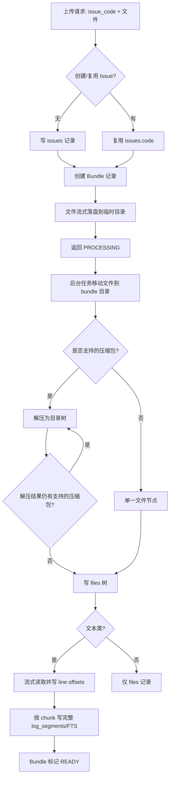

# 数据库设计概览

当前默认使用 SQLite，数据库文件由 `DATABASE_URL` 控制，默认示例为 `sqlite://../data/rain.db`。后端启动时会自动创建数据库文件的父目录，并执行 `CREATE TABLE IF NOT EXISTS` 初始化表结构。

## 设计取舍

- SQLite 适合当前本地 MVP：部署简单、无需单独数据库服务、方便重新启动项目。
- SQLite 连接启用 WAL、`synchronous=NORMAL` 和 30 秒 `busy_timeout`，降低读写互相阻塞的概率。
- 当前搜索使用 SQLite FTS5 trigram external-content 索引。文本日志按 chunk 建索引，正文仅存于 `log_segments.content`；启动时会将旧 FTS 结构迁移并从权威 segment 数据重建索引。
- 上传请求只负责接收文件；解压、内容寻址 Blob 写入、行偏移和 FTS 在 `.tmp/{task_id}/staging` 后台执行。
- 后台任务完成 Blob 发布与索引后标记 `READY` 并清理 staging；失败时清理半成品 file/index 记录，并保留带结构化失败信息的 Bundle 状态。
- 后台解析使用流式读取和事务批量写入，日志索引每 5000 行提交一次，避免大文件一次性读入内存、逐行零散提交和过长写事务。
- 当前 `meta` 以 JSON 字符串存储在 TEXT 列中；后续如要对象存储或多节点部署，关键存储路径应提升为明确列。
- 生产化前建议引入迁移工具，不要长期依赖启动时建表。

## 表：issues

- `status` TEXT：Issue 生命周期，正常为 `ACTIVE`，删除开始时切换为 `DELETING`。
- 上传创建 Bundle 使用 `INSERT ... SELECT FROM issues WHERE status='ACTIVE'`，把存在性与状态检查合并为一个原子数据库操作。

- `code` TEXT PK：Issue 编号（上传归属键）。
- `name` TEXT：显示名称（默认与 `code` 相同）。
- `description` TEXT：描述。
- `created_at` TEXT：创建时间，默认 `CURRENT_TIMESTAMP`。

## 表：bundles

- `id` TEXT PK：内部 bundle ID，由后端生成 UUID 字符串。
- `issue_code` TEXT：关联 `issues.code`，级联删除。
- `hash` TEXT UNIQUE：bundle 的公开 ID，前端和 API 使用它定位 bundle。
- `name` TEXT：bundle 显示名（当前为 `bundle-{hash}`）。
- `status` TEXT：Bundle 生命周期，只使用 `PENDING / PROCESSING / READY / FAILED / DELETING / DELETED`。
- `process_stage` TEXT：处理中的当前操作，只使用 `RECEIVING / EXTRACTING / INDEXING / PUBLISHING`；完成或失败后保留最后一次操作。
- `failure_stage`、`failure_code`、`failure_reason`、`retryable`：结构化失败诊断。
- `deleted_at` TEXT：Bundle 逻辑删除时间；未删除时为 NULL。
- `size_bytes` INTEGER：本次上传总字节数。
- `content_size_bytes` INTEGER：计入 Issue 配额的最终可浏览文件总字节数；压缩包和目录本身不重复计入。
- `created_at` TEXT：创建时间，默认 `CURRENT_TIMESTAMP`。
- 索引：`idx_bundles_issue (issue_code, created_at DESC)`。

## 表：files

- `id` INTEGER PK AUTOINCREMENT。
- `bundle_id` TEXT：关联 `bundles.id`，级联删除。
- `parent_id` INTEGER：自关联父节点，级联删除。
- `blob_id` INTEGER：关联 `blobs.id`；目录与旧版兼容记录可为 NULL。
- `name` TEXT：文件/目录名。
- `path` TEXT：bundle 内路径，如 `/{bundle_hash}/{file_name}`。
- `is_dir` INTEGER：是否目录，按 bool 读写。
- `size_bytes` INTEGER：文件大小，目录为 NULL。
- `line_count` INTEGER：文本文件行数，用于分页展示。
- `mime_type` TEXT：MIME。
- `status` TEXT：状态标签（预留）。
- `meta` TEXT：展示和分类元数据，例如原始文件名；`storage_path` 仅作为升级前旧记录的兼容字段读取。
- `created_at` TEXT：创建时间，默认 `CURRENT_TIMESTAMP`。
- 约束：`UNIQUE (bundle_id, path)`。
- 索引：`idx_files_parent`、`idx_files_bundle`、`idx_files_path`、`idx_files_blob`。

## 表：log_segments

- `id` INTEGER PK AUTOINCREMENT。
- `bundle_id` TEXT：关联 `bundles.id`，级联删除。
- `file_id` INTEGER：关联 `files.id`，级联删除。
- `timeline` TEXT：时间轴标签，当前固定为 `all`。
- `content` TEXT：日志 chunk 内容，通常最多 200 行，已去空行和空字节。
- `line_offset` INTEGER：chunk 起始原始行号，从 0 开始。
- `line_end` INTEGER：chunk 结束原始行号，从 0 开始。
- `chunk_index` INTEGER：文件内 chunk 序号，从 0 开始。
- `created_at` TEXT：创建时间，默认 `CURRENT_TIMESTAMP`。
- 索引：`idx_logs_bundle_timeline`、`idx_logs_file_chunk`；全文检索走 `log_segments_fts`。

## 表：log_line_offsets

- `file_id` INTEGER：关联 `files.id`，级联删除。
- `line_number` INTEGER：采样行号，从 0 开始。
- `byte_offset` INTEGER：该行在原始文件中的字节偏移。
- 主键：`(file_id, line_number)`。
- 用途：分页读取时先跳到最近采样点，再顺序读取目标页，避免每次从文件开头数行。

## 表：log_segments_fts

- SQLite FTS5 虚表。
- 使用 `content='log_segments'` 与 `content_rowid='id'` 的 external-content 模式，FTS 仅维护倒排索引，不保存日志正文副本。
- 唯一索引列为 `content`；FTS `rowid` 对应 `log_segments.id`。
- bundle、Issue、文件与 timeline 范围过滤通过 `rowid` 关联 `log_segments`、`bundles` 和 `files` 完成。
- `log_segments` 的插入、更新与删除触发器负责同步维护索引。

## 表：blobs

- `content_hash`：文件内容的 SHA-256，唯一。
- `size_bytes`：Blob 实际字节数。
- `storage_backend`：当前为 `local`，为远程对象存储预留扩展点。
- `storage_key`：本地为 `blobs/<hash前两位>/<完整hash>`，不包含 Bundle UUID。
- `state` 状态机：`STAGING → READY → PENDING_DELETE`；完整性检查会把丢失对象标记为 `MISSING`，大小不一致对象标记为 `CORRUPTED`。
- 重复上传不会把已被引用的 `READY` Blob 降级；`PENDING_DELETE/MISSING/CORRUPTED` 必须经过物理对象重新发布及存在性、大小校验后，才能从 `STAGING` 回到 `READY`。
- `files.blob_id` 引用 Blob；目录和升级前的兼容记录可为空。
- `files.path` 是逻辑路径（保留现有 API 字段名），不再用于定位新上传文件的物理位置。
- 删除文件、Bundle 或 Issue 后，仅回收已经没有任何 `files` 引用的 READY Blob。
- 字节存储通过统一的 `BlobStore` 接口访问：`put`、`open`、`materialize`、`exists`、`verify_size`、`verify`、`delete`。当前实现为 `LocalCasBlobStore`。
- `verify` 先检查字节数，再流式计算 SHA-256 并与 `content_hash` 比较；`STAGING → READY`、启动恢复和完整性审计必须使用完整校验，普通读取不重复计算哈希。
- 同一 `content_hash` 的发布使用进程内异步锁串行化；临时对象先做完整校验，锁内再次验证目标，目标正确则丢弃临时文件，否则使用平台原子替换（Windows 使用 `MoveFileExW`）。
- `put` 已完整确认内容后，数据库 claim 后仅用 `verify_size` 复查对象仍存在且大小一致，以防上传/GC 竞态，同时避免正常重复上传对已有 Blob 再做第二次完整 Hash；若对象消失并重新发布，仍执行完整 `verify`。
- 路由、读取器、上传流程和回收流程只依赖 `Arc<dyn BlobStore>`；本地根目录与路径拼接被封装在本地实现内部，为缓存式 MinIO/S3 或 IPFS 实现预留替换点。
- 读取 Blob 前必须确认记录的 `storage_backend` 与当前 `BlobStore::backend_name()` 一致；多后端并存时应由后续 `BlobStoreRegistry` 按 backend 路由。
- Bundle 删除先原子写入 `status='DELETING'` 和 `deleted_at`，使所有查询立即隐藏，再由后台幂等清理索引、文件引用和旧目录；全部完成后写入 `DELETED`，服务重启会恢复未完成的删除。
- Issue 删除同步复用每个 Bundle 的 `finish_bundle_deletion`；所有 Bundle 清理成功后才删除 Issue，失败后可再次请求从 `DELETING` 继续。
- 后台 Blob GC 每小时扫描一次，始终使用 `NOT EXISTS (SELECT 1 FROM files WHERE files.blob_id = blobs.id)` 确认无引用，不维护易失真的引用计数。
- 无引用的 `MISSING` Blob 直接删除数据库记录；无引用的 `CORRUPTED` Blob 删除物理对象后再删除记录，两者不永久滞留。
- `verified_at` 记录最近一次完整 SHA-256 审计时间。全量审计不阻塞 HTTP 启动；后台每小时按最久未校验优先处理，单批最多 100 个 Blob 或 5 GiB。
- 首次发现无引用时写入 `unreferenced_at`；默认宽限 24 小时。宽限期内重新出现引用会清除该时间，超过宽限期才进入 `PENDING_DELETE` 并删除物理对象。
- 删除升级前 `blob_id IS NULL` 的 Bundle 时，会先收集并删除受 data-root 边界保护的旧路径，再清理数据库记录；若物理删除失败则保留 `DELETING` 与文件行，便于安全重试。过期 Bundle 清理使用相同流程。

## Bundle 处理状态机

- 生命周期为 `PENDING → PROCESSING → READY`；失败进入 `FAILED`，删除经过 `DELETING → DELETED`。
- `process_stage` 独立记录 `RECEIVING / EXTRACTING / INDEXING / PUBLISHING`。混合文件和嵌套压缩包逐项处理时允许按当前实际操作切换，例如 `INDEXING → EXTRACTING`，不会再被单向 rank 规则忽略。
- 失败后仅将 `status` 设为 `FAILED`，`process_stage` 保留最后操作，并额外记录 `failure_stage`、`failure_code`、`failure_reason` 和 `retryable`。
- 服务启动时发现未完成任务，会记录 `PROCESS_INTERRUPTED`，保留中断阶段并标记为可重试。

## 关系与典型上传

- Issue -> 多个 Bundle：同一个 Issue 可多次上传，每次形成一个 Bundle。
- Bundle -> Files：单文件上传会形成一个顶层 file 节点；每一层 `.zip`、`.tar.gz`、`.tgz`、`.gz` 都保留原始压缩包节点，并在其下挂载一个 `{archive_name}_extracted` 解压目录。
- Files -> Log Segments：文本类文件（扩展名 log/txt 等或 content-type `text/*`）会流式读取并按 chunk 写入 `log_segments` 供搜索；非文本文件仅保留 `files` 记录。
- Files -> Line Offsets：文本类文件会每 1000 行记录一次 byte offset，用于 `/lines` 分页读取。
- 单行默认读取上限为 8 MiB，超过后会丢弃到下一个换行符，并在索引/分页内容中追加 `[line truncated]` 标记。

## 上传流程

递归解压、文本扫描和索引全部在 `.tmp/{task_id}/staging/{bundle_hash}` 中完成。嵌套深度、条目总数和 Issue 内容容量由同一 bundle 共享预算；任一层损坏或超过安全限制时，任务标记为 `FAILED`，并删除 staging 文件及该 bundle 的 `files`、行偏移和 FTS 半成品记录。
